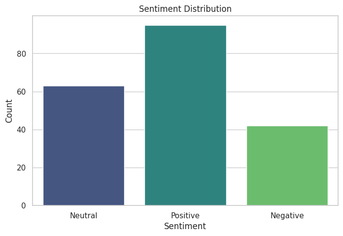
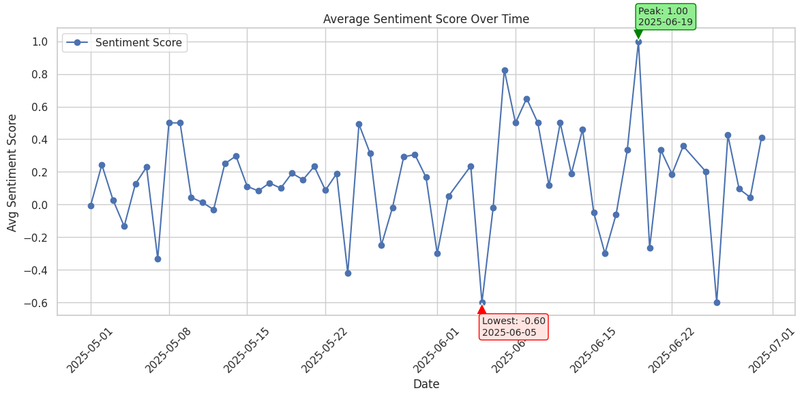
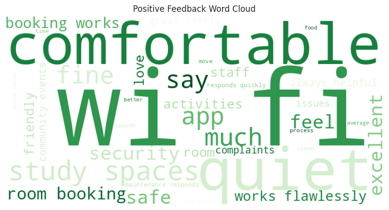
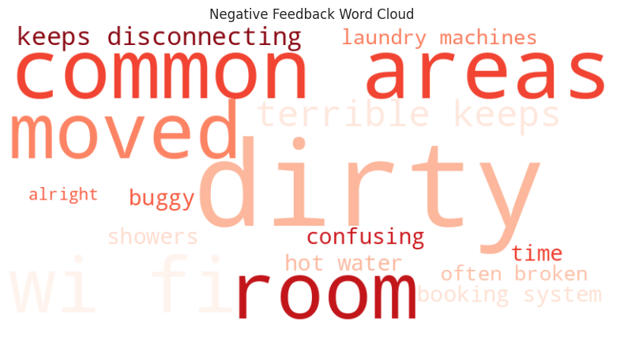

# 🧠 Resident Feedback Sentiment Analysis

This project analyzes simulated resident feedback using sentiment analysis and data visualization. The goal is to identify trends, extract actionable insights, and support data-driven improvements to student residential experiences.

---

## 📊 Features

- 🔍 Natural Language Processing (NLP) with TextBlob
- 📈 Time-based sentiment trend visualization
- ☁️ Word clouds for positive and negative feedback
- 🗂 Summary tables for decision-making
- ✅ Clean and reusable Jupyter Notebook

---

## 🛠 Tools Used

- Python, Jupyter Notebook
- pandas, seaborn, matplotlib
- TextBlob (`sentiment.polarity`)
- WordCloud
- Excel (for input/export)

---

## 📊 Sentiment Distribution

- Total feedback entries: **200**
- Sentiment breakdown:
  - ✅ Positive: 95 (47.5%)
  - 🟡 Neutral: 63 (31.5%)
  - ❌ Negative: 42 (24.0%)



---

## 📈 Sentiment Over Time

- 📈 **Peak Sentiment**: 01.00 on **19 June**
- 📉 **Lowest Sentiment**: 0.65 on **06 May**

This visual trend helps uncover patterns related to events, outages, or service improvements.



---

## ☁️ Word Clouds

### ✅ Positive Feedback Highlights

Common words: *clean, staff, friendly, comfortable, helpful*



---

### 🚫 Negative Feedback Highlights

Common words: *wifi, broken, noisy, maintenance, dirty*



---

## 📌 Summary of Insights

| Metric                    | Value         |
|--------------------------|----------------|
| Total Feedback Entries   | 200            |
| Positive Sentiment       | 47.5% (95)     |
| Neutral Sentiment        | 31.5% (63)     |
| Negative Sentiment       | 21.0% (42)     |
| Peak Sentiment Date      | 19 June 2025   |
| Lowest Sentiment Date    | 06 May 2025    |

---

## 🚀 How to Run This Project

1. **Clone the repository**:
   ```bash
   git clone https://github.com/your-username/resident-feedback-analysis.git


